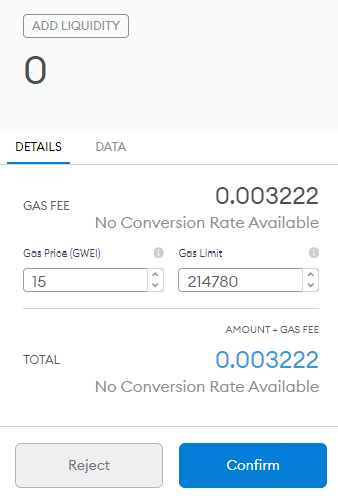
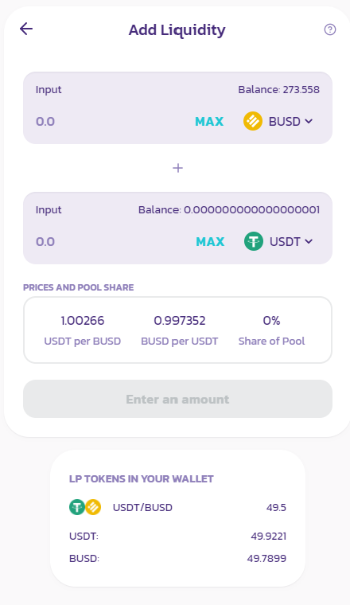

The purpose of this document is to help you get a real taste as a participant in DeFi on BSC (Binance Smart Chain), we will go from zero to staking BUSD/USDT in minutes.

We will exchange a token so that you have two tokens and then participate in risk free Liquidity Provision (though you will lose fees).

## Prerequisites

MetaMask or BSC wallet

Some crypto that you are prepared to experiment with

A binance account with some funds (though i can help if you don’t have this, let me know as that is another ELI5 which will follow after this)

Only follow the links that i provide, google is not your friend, there are many spoofing websites. These are all official links.

**PLEASE NOTE : Transfers from Binance to BSC you BEP20**

#### 1. Install Metamask.

https://metamask.io/download.html

Metamask works on both Ethereum and BSC. It uses the same address for both.

For example, if your ethereum address is:

    0xeb31973e0febf3e3d7058234a5ebbae1ab4b8c23

Then your BSC address is:

    0xeb31973e0febf3e3d7058234a5ebbae1ab4b8c23

(btw, that is the address of the Kucoin hacker, if you want to have a look at what thet did then go here Etherscan KK Hacker.

#### 2. Configure MetaMask for BSC

Follow these instructions here

https://www.binance.com/en/blog/421499824684901055/Get-Started-on-Binance-Smart-Chain-in-60-Seconds

#### 3. Check the address on BSC

Go to https://www.bscscan.com and type into the wallet address, it will show as an empty address.

Bookmark that as you will need to refer to that as it is more reliable than anything else.

#### 4. Fund the wallet with BNB 0.5

You will need BNB, this is the proprietary token of Binance, this is what we use to pay for gas.

To fund the wallet, just go through the standard binance withdrawal procedure. Select BEP20

Once you have sent the funds, switch to your address on BSCscan and refresh the page until the funds arrive, usually it is in seconds.

#### 5. If the BNB arrived ok

then withdraw from your binance account to the address, $100 of one stable, either BUSD or USDT. (Only send one type as we will go through the process of exchanging 50% of the token on pancakeswap.

#### 6. Check your BSC scan address.

Once it has arrived, open up your BSC configured metamask., ensuring that you have selected the BSC network in the dropdown at the top of Metamask.

You will see the BNB, it shows as ETH, but it is BNB.

You will not see the stables in your metamask, you will need to add a custom token as the token.

#### 7. Add the token to the metamask wallet

On the assets tab, select add token

Select Custom Token

In contact address paste the following into the correct fields

**USDT**

    Token Address - 0x55d398326f99059ff775485246999027b3197955
    Token Symbol = USDT
    Decimals = 18

Select Next until the token is added

**BUSD**

    Token address = 0xe9e7cea3dedca5984780bafc599bd69add087d56
    Token Symbol = BUSD
    Decimals = 18

#### 8. Select Next until the token is added

In the metamask assets tab you will see 2 tokens, only one of those should have a balance of the $100 that you sent, the other will be empty

For reference, these are the token pages

BUSD Token page is https://www.bscscan.com/token/0xe9e7cea3dedca5984780bafc599bd69add087d56

USDT Token page is
https://www.bscscan.com/token/0x55d398326f99059ff775485246999027b3197955

#### 9. Now we will exchange one of the tokens

ie. if you send 100 BUSD we exchange 50 USDT for BUSD

#### 10. Go to https://exchange.pancakeswap.finance/#/swap

The following screenshot is what you will see, there is your bnb

#### 11. In the FROM drop down

select the USDT or BUSD token, depending on what you sent, that you want to swap, add in the quantity.

#### 12. In the TO drop down select USDT (or BUSD) etc.

You can type USDT or BUSD in the search box, or you can scroll.

Though, this is a one time operation, once you have added this token to that wallet in Metamask if will remain unless you remove it

You may also paste the token address from an official source such as www.pancakeswap.info or BSCscan, which is my normal way of doing this thanks to all the spoofy tokens on Ethereum.

Select USDT

#### 13. You will now be presented with this screen

#### 14. Select ‘Approve USDT (BUSD)

A metamask wallet will pop up requesting pancakeswap to spend your BUSD/USDT

#### 15. Confirm it

And after a few seconds the approve button will grey out and show Approved.

#### 16. Select ‘Swap’ and exchange your BUSD for USDT

the following screen will pop up, select confirm swap

#### 17. Confirm the swap in the metamask window that pops up.

The transaction will complete in a few seconds.

#### 18. Check the swap completed by selecting the FROM dropdown.

Also check to see that you can see the token in the assets tab on metamask

#### 19. You have now completed your first swap on Pancakeswap.

Now will follow the staking on pancake swap

---

### Staking on Pancakeswap

1. First go here and identify the farm that you want to stake in, though we are going to use the BUSD/USDT farm.

   https://pancakeswap.finance/farms

   There are a lot of pools here, this is the one that we will stake in

   

1. Select approve contract, metamask will pop up, confirm the approval (the approval is allowing pancakeswap to spend your tokens. It is a one time event.

   

1. Now that it is approved, we will navigate to providing liquidity on Pancakeswap

   https://exchange.pancakeswap.finance/#/pool

   

1. Select ADD LIQUIDITY

1. Use the two drop downs and select USDT and BUSD as the Inputs

   

1. In the above image, you will see that the lowest quantity of a token is USDT, basically you want to supply MAX quantity of the token with the lowest quantity. The quantity will then be automatically populated in the other token.

   

1. Select supply, and the following window will appear

   

1. Confirm supply and the metamask window will pop up

   

1. Once confirmed, you will see this screen that shows the LP tokens in your wallet

   

1. You are now officially an Liquidity provider of BUSD/USDT on Pancakswap, BSC.

   So now we move onto staking, where we will stake those LP tokens into the farm
   Yield Farming

1. Go back to the farms and scroll down until you see the contract that you already approved.

   https://pancakeswap.finance/farms

   

1. Select stake LP

   

1. Select Max

   

1. Select Confirm

   

1. Once confirmed the pool will look like this

   

1. You are now farming yield, and in this instance you are actually farming CAKE, the platform token of Pancakeswap which is current worth $2.949 each. Rewards will be paid out once you select HARVEST and i will add to this later, once we have something to harvest. On this farm the APY is 30.79%, where it says that, you can see a small calculator icon, select that and you can see you daily ROI

   

1. Welcome to the club……...
